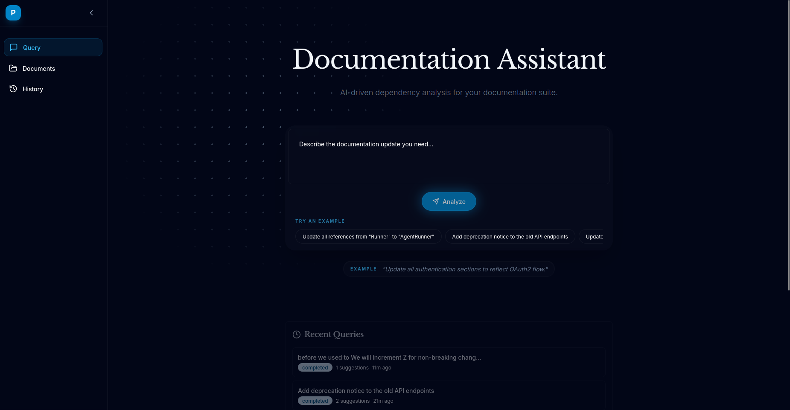

# doc_reader

This is an AI agent platform designed to analyze technical documentation and propose intelligent edits, using a simple "Reasoning & Action" (ReAct) loop.

## What happens

* **Autonomous AI Agent**: Uses a ReAct loop to perform multi-step analysis (Search -> Read -> Propose).
* **Real-time Streaming (SSE)**: Watch the AI's "thought process" live as it executes tools and finds sections.
* **Intelligent Diffing**: View original vs. suggested text in split or unified modes.
* **Vector Search**: Powered by ChromaDB for semantic retrieval of relevant document sections.
* **Asynchronous Processing**: Celery & Redis handle long-running AI tasks without blocking the UI.

## The Tech Stack

### Backend
- **Framework**: FastAPI (Python 3.12)
- **Database**: PostgreSQL (SQLAlchemy + AsyncPG)
- **Task Queue**: Celery + Redis
- **Vector Store**: ChromaDB
- **LLM**: OpenAI GPT-4o (via Tool Calling)

### Frontend
- **Framework**: Next.js 14 (App Router)
- **Server State**: TanStack React Query (v5)
- **Client State**: Zustand (with Persist middleware)
- **Styling**: Tailwind CSS

---

## Architecture Flow

1.  **Query Input**: User submits a natural language request (e.g., "Standardize the Runner nomenclature").
2.  **Task Delegation**: FastAPI triggers a Celery worker.
3.  **Agent Loop**:
    * `semantic_search`: Finds relevant sections in ChromaDB.
    * `get_section_content`: Reads the full text of candidate sections.
    * `propose_edit`: Generates a suggestion with reasoning and confidence.
4.  **Live Updates**: The worker publishes events to Redis; the frontend streams these via Server-Sent Events (SSE).
5.  **Human-in-the-loop**: User reviews, edits, or accepts the suggestions.

Simple SSE without background tasks also an alternative implemented in the code, as well as an option without streaming at all with just Celery.

---

Phase 0 ✅

- Project structure created
- Docker Compose for PostgreSQL + ChromaDB
- Environment configuration
- README and TRADEOFFS docs

Phase 1 ✅

- SQLAlchemy models (Document, Section, Query, Suggestion, History, Dependencies)
- Pydantic schemas for all models
- Database session management
- Document service with section parsing
- History service

Phase 2 ✅

- ChromaDB search service with OpenAI embeddings
- AI orchestrator with streaming
- SSE endpoints for real-time progress
- All API routes (documents, queries, suggestions, history)
- Optional Celery Tasks for Background Job Orchestration - Query Processing and Document Reindexing Tasks

ToDo:

- Phase 3-4: Frontend (Next.js setup, components, streaming UI) ✅
- Phase 5-7: Advanced features (dependency visualization, preview mode) ✅
- Preview Mode: YES, Dependency Vis: NO
- Integration Tests, TypeSafety Needs to be Redone, Deployment

